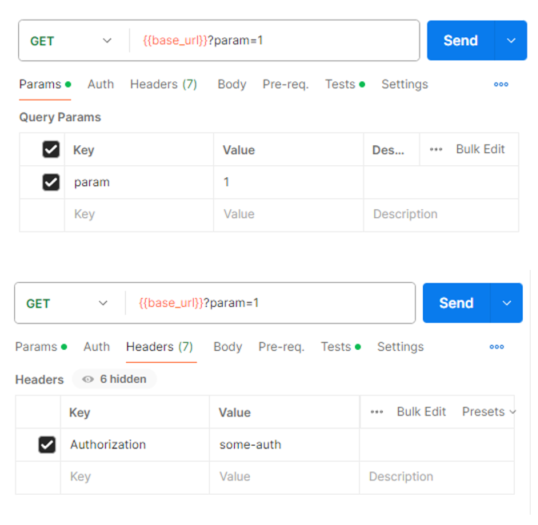
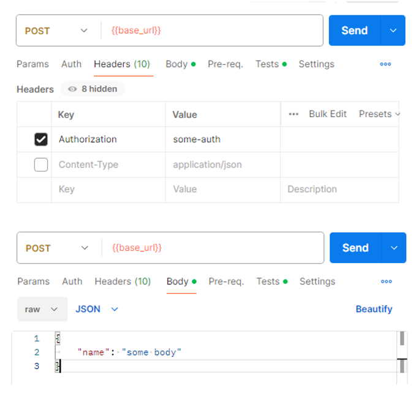
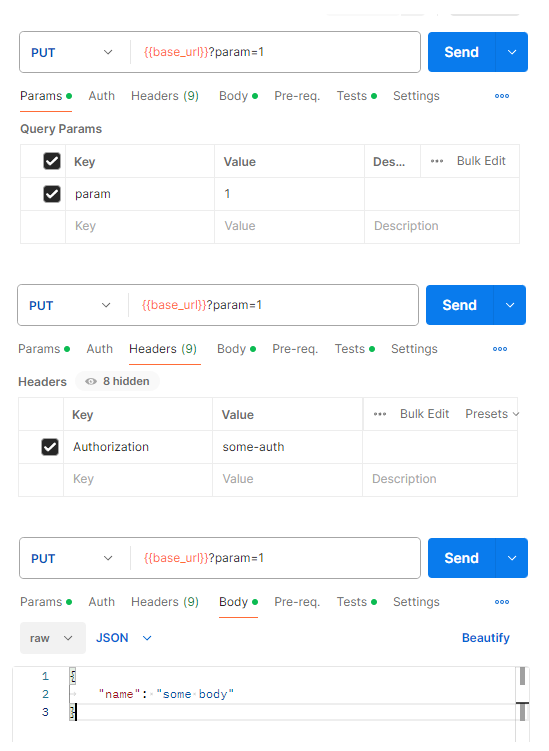
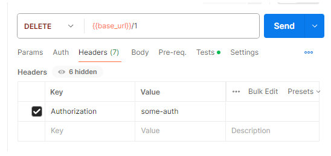
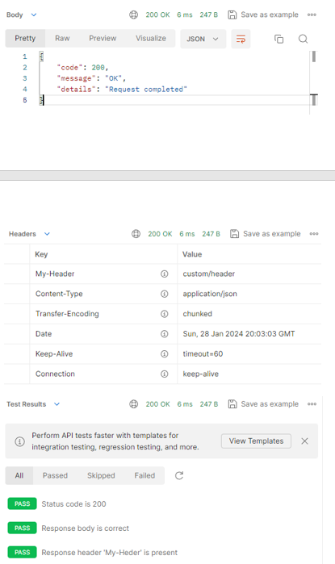
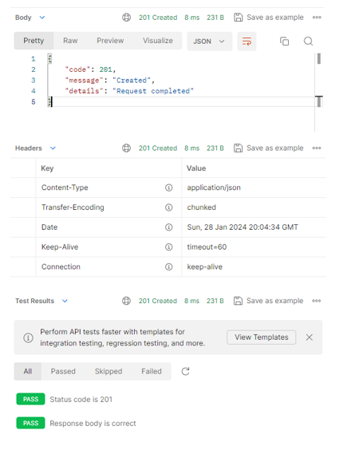
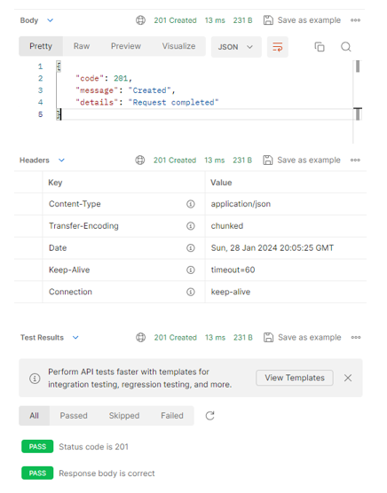
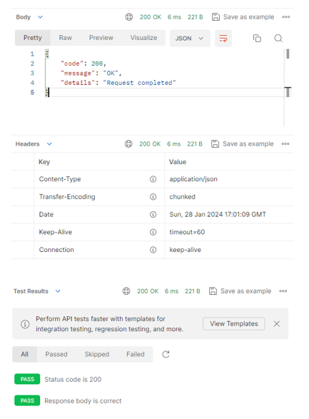

Переменная {{base_url}} = http://localhost:8080/my-rest

# «Успешные сценарии»

## Тесты:

### GET



Код автотеста Postman:

```json
var expCode = 200
var expMessage = "OK"
var expDetails = "Request completed"

pm.test("Status code is " + expCode, function () {
  pm.response.to.have.status(expCode);
});

pm.test("Response body is correct", function () {
    var jsonData = pm.response.json();
    pm.expect(jsonData.code).to.eql(expCode);
    pm.expect(jsonData.message).to.eql(expMessage);
    pm.expect(jsonData.details).to.eql(expDetails);
});

pm.test("Response header 'My-Heder' is present", function () {
  pm.response.to.have.header("My-Header");
});
```

### POST



Код автотеста Postman:

```json
var expCode = 201
var expMessage = "Created"
var expDetails = "Request completed"

pm.test("Status code is " + expCode, function () {
pm.response.to.have.status(expCode);
});

pm.test("Response body is correct", function () {
var jsonData = pm.response.json();
pm.expect(jsonData.code).to.eql(expCode);
pm.expect(jsonData.message).to.eql(expMessage);
pm.expect(jsonData.details).to.eql(expDetails);
});
```

### PUT



Код автотеста Postman:

```json
var expCode = 201
var expMessage = "Created"
var expDetails = "Request completed"

pm.test("Status code is " + expCode, function () {
pm.response.to.have.status(expCode);
});

pm.test("Response body is correct", function () {
var jsonData = pm.response.json();
pm.expect(jsonData.code).to.eql(expCode);
pm.expect(jsonData.message).to.eql(expMessage);
pm.expect(jsonData.details).to.eql(expDetails);
});
```

### DELETE



Код автотеста Postman:

```json
var expCode = 200
var expMessage = "OK"
var expDetails = "Request completed"

pm.test("Status code is " + expCode, function () {
pm.response.to.have.status(expCode);
});

pm.test("Response body is correct", function () {
var jsonData = pm.response.json();
pm.expect(jsonData.code).to.eql(expCode);
pm.expect(jsonData.message).to.eql(expMessage);
pm.expect(jsonData.details).to.eql(expDetails);
});
```

## Результаты тестов
### GET

### POST

### PUT

### DELETE

# Глава №2 «Альтернативные сценарии»
## Тесты
### GET (Error without Auth header)
.png)
Код автотеста Postman:
```json
var expTimestampRegExp = /\d{4}-\d{2}-\d{2}T\d{2}:\d{2}:\d{2}.\d{3}\+\d{2}:\d{2}/
var expStatus = 400
var expError = "Bad Request"
var expPath = "/my-rest"

pm.test("Status code is " + expStatus, function () {
pm.response.to.have.status(expStatus);
});

pm.test("Response body is correct", function () {
var jsonData = pm.response.json();
pm.expect(jsonData.timestamp).to.match(expTimestampRegExp);
pm.expect(jsonData.status).to.eql(expStatus);
pm.expect(jsonData.error).to.eql(expError);
pm.expect(jsonData.path).to.eql(expPath);
});
```

### GET (Error without param)
.png)
Код автотеста Postman:
```json
var expTimestampRegExp = /\d{4}-\d{2}-\d{2}T\d{2}:\d{2}:\d{2}.\d{3}\+\d{2}:\d{2}/
var expStatus = 400
var expError = "Bad Request"
var expPath = "/my-rest"

pm.test("Status code is " + expStatus, function () {
pm.response.to.have.status(expStatus);
});

pm.test("Response body is correct", function () {
var jsonData = pm.response.json();
pm.expect(jsonData.timestamp).to.match(expTimestampRegExp);
pm.expect(jsonData.status).to.eql(expStatus);
pm.expect(jsonData.error).to.eql(expError);
pm.expect(jsonData.path).to.eql(expPath);
});
```

### POST (Error without Auth header)
.png)
Код автотеста Postman:
```json
var expTimestampRegExp = /\d{4}-\d{2}-\d{2}T\d{2}:\d{2}:\d{2}.\d{3}\+\d{2}:\d{2}/
var expStatus = 400
var expError = "Bad Request"
var expPath = "/my-rest"

pm.test("Status code is " + expStatus, function () {
pm.response.to.have.status(expStatus);
});

pm.test("Response body is correct", function () {
var jsonData = pm.response.json();
pm.expect(jsonData.timestamp).to.match(expTimestampRegExp);
pm.expect(jsonData.status).to.eql(expStatus);
pm.expect(jsonData.error).to.eql(expError);
pm.expect(jsonData.path).to.eql(expPath);
});
```

### POST (Error without body)
.png)
Код автотеста Postman:
```json
var expTimestampRegExp = /\d{4}-\d{2}-\d{2}T\d{2}:\d{2}:\d{2}.\d{3}\+\d{2}:\d{2}/
var expStatus = 400
var expError = "Bad Request"
var expPath = "/my-rest"

pm.test("Status code is " + expStatus, function () {
pm.response.to.have.status(expStatus);
});

pm.test("Response body is correct", function () {
var jsonData = pm.response.json();
pm.expect(jsonData.timestamp).to.match(expTimestampRegExp);
pm.expect(jsonData.status).to.eql(expStatus);
pm.expect(jsonData.error).to.eql(expError);
pm.expect(jsonData.path).to.eql(expPath);
});
```

### PUT (Error without Auth header)
.png)
Код автотеста Postman:
```json
var expTimestampRegExp = /\d{4}-\d{2}-\d{2}T\d{2}:\d{2}:\d{2}.\d{3}\+\d{2}:\d{2}/
var expStatus = 400
var expError = "Bad Request"
var expPath = "/my-rest"

pm.test("Status code is " + expStatus, function () {
pm.response.to.have.status(expStatus);
});

pm.test("Response body is correct", function () {
var jsonData = pm.response.json();
pm.expect(jsonData.timestamp).to.match(expTimestampRegExp);
pm.expect(jsonData.status).to.eql(expStatus);
pm.expect(jsonData.error).to.eql(expError);
pm.expect(jsonData.path).to.eql(expPath);
});
```

### PUT (Error without param)
.png)
Код автотеста Postman:
```json
var expTimestampRegExp = /\d{4}-\d{2}-\d{2}T\d{2}:\d{2}:\d{2}.\d{3}\+\d{2}:\d{2}/
var expStatus = 400
var expError = "Bad Request"
var expPath = "/my-rest"

pm.test("Status code is " + expStatus, function () {
pm.response.to.have.status(expStatus);
});

pm.test("Response body is correct", function () {
var jsonData = pm.response.json();
pm.expect(jsonData.timestamp).to.match(expTimestampRegExp);
pm.expect(jsonData.status).to.eql(expStatus);
pm.expect(jsonData.error).to.eql(expError);
pm.expect(jsonData.path).to.eql(expPath);
});
```

### PUT (Error without body)
.png)
Код автотеста Postman:
```json
var expTimestampRegExp = /\d{4}-\d{2}-\d{2}T\d{2}:\d{2}:\d{2}.\d{3}\+\d{2}:\d{2}/
var expStatus = 400
var expError = "Bad Request"
var expPath = "/my-rest"

pm.test("Status code is " + expStatus, function () {
pm.response.to.have.status(expStatus);
});

pm.test("Response body is correct", function () {
var jsonData = pm.response.json();
pm.expect(jsonData.timestamp).to.match(expTimestampRegExp);
pm.expect(jsonData.status).to.eql(expStatus);
pm.expect(jsonData.error).to.eql(expError);
pm.expect(jsonData.path).to.eql(expPath);
});
```

### DELETE (Error without Auth header)
.png)
Код автотеста Postman:
```json
var expTimestampRegExp = /\d{4}-\d{2}-\d{2}T\d{2}:\d{2}:\d{2}.\d{3}\+\d{2}:\d{2}/
var expStatus = 400
var expError = "Bad Request"
var expPath = "/my-rest/1"

pm.test("Status code is " + expStatus, function () {
pm.response.to.have.status(expStatus);
});

pm.test("Response body is correct", function () {
var jsonData = pm.response.json();
pm.expect(jsonData.timestamp).to.match(expTimestampRegExp);
pm.expect(jsonData.status).to.eql(expStatus);
pm.expect(jsonData.error).to.eql(expError);
pm.expect(jsonData.path).to.eql(expPath);
});
```

### DELETE (Error without path variable)
.png)
Код автотеста Postman:
```json
var expTimestampRegExp = /\d{4}-\d{2}-\d{2}T\d{2}:\d{2}:\d{2}.\d{3}\+\d{2}:\d{2}/
var expStatus = 405
var expError = "Method Not Allowed"
var expPath = "/my-rest"

pm.test("Status code is " + expStatus, function () {
pm.response.to.have.status(expStatus);
});

pm.test("Response body is correct", function () {
var jsonData = pm.response.json();
pm.expect(jsonData.timestamp).to.match(expTimestampRegExp);
pm.expect(jsonData.status).to.eql(expStatus);
pm.expect(jsonData.error).to.eql(expError);
pm.expect(jsonData.path).to.eql(expPath);
});
```

## Результаты тестов
### GET (Error without Auth header)
.png)
### GET (Error without param)
.png)
### POST (Error without Auth header)
.png)
### POST (Error without body)
.png)
### PUT (Error without Auth header)
.png)
### PUT (Error without param)
.png)
### PUT (Error without body)
.png)
### DELETE (Error without Auth header)
.png)
### DELETE (Error without path variable)
.png)